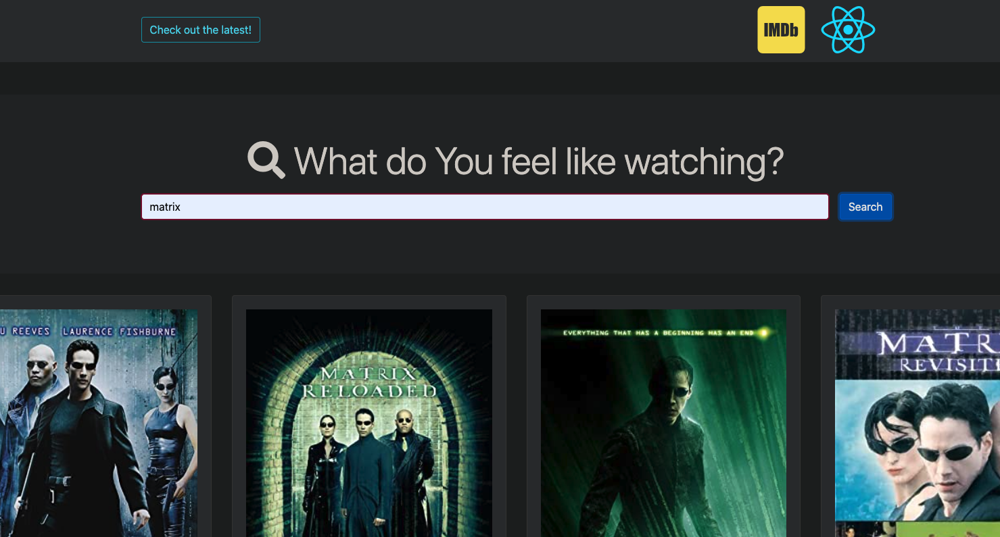

# EnjoYou

An entertainment webapp using public API to display books, videos, and movies powered by React.js and Rails API. It helps users to easily search and view content details.

## Features
* a user can search and review books with details
* a user can search and open videos from YouTube
* a user can search and review movies with details

## Technologies
* React.js
* Ruby on Rails
* JavaScript
* Bootstrap
* Redux
* Google Book API
* Rapid YouTube API
* Imdb Movie API

## Setup

To clone and run this application, you'll need Git, React.js (which comes with npm) and Rails installed on your computer.
Clone this repo to your desktop and run npm install to install all the dependencies.

## To-do list:
* Create nested routes in React router for each book, video, and movie items
* Use Redux global state to store and manage books and videos
* Add user log in and sign up page
* Use JWT Auth in Redux and Rails